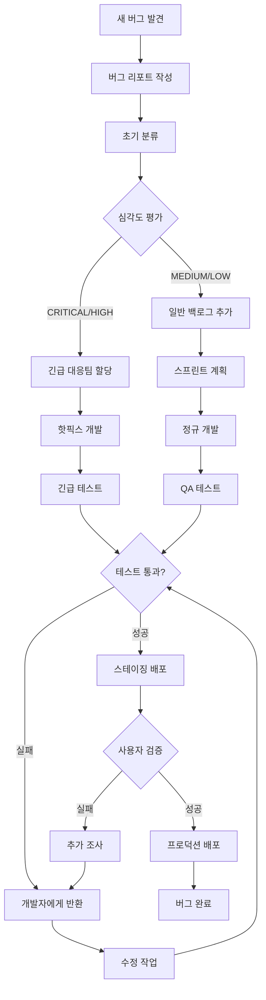

# **8. 버그 리포트 및 이슈 추적 (Bug Report & Issue Tracking)**

**참조 문서**: 0_architecture.md, 7_unit_Integration_Test.md
**작성일**: 2025-09-16
**버전**: 1.0

## **8.1 버그 분류 체계 (Bug Classification System)**

### **8.1.1 심각도 분류 (Severity Classification)**
```typescript
enum BugSeverity {
  CRITICAL = "critical",    // 시스템 전체 장애, 데이터 손실
  HIGH = "high",           // 핵심 기능 동작 불가
  MEDIUM = "medium",       // 일부 기능 이상, 우회 방법 존재
  LOW = "low",            // UI 문제, 성능 저하
  TRIVIAL = "trivial"     // 오타, 미세한 UI 불일치
}

enum BugPriority {
  P0 = "p0",              // 즉시 수정 (24시간 내)
  P1 = "p1",              // 긴급 수정 (3일 내)
  P2 = "p2",              // 중요 수정 (1주 내)
  P3 = "p3",              // 일반 수정 (2주 내)
  P4 = "p4"               // 저우선순위 (다음 버전)
}
```

## **8.2 버그 리포트 템플릿 (Bug Report Templates)**

### **8.2.1 표준 버그 리포트**
```markdown
# Bug Report: [BUG-YYYY-NNNN] 제목

## 기본 정보
- **발견일**: YYYY-MM-DD
- **리포터**: [이름/역할]
- **심각도**: [CRITICAL/HIGH/MEDIUM/LOW/TRIVIAL]
- **우선순위**: [P0/P1/P2/P3/P4]
- **컴포넌트**: [해당 컴포넌트]
- **영향 범위**: [사용자 수/기능 범위]

## 환경 정보
- **플랫폼**: [iOS/Android/Web]
- **OS 버전**: [버전 정보]
- **앱 버전**: [버전 번호]
- **디바이스**: [디바이스 모델]
- **네트워크**: [WiFi/Cellular/상태]

## 버그 설명
### 현재 동작 (Actual Behavior)
[현재 어떻게 동작하는지 상세 설명]

### 예상 동작 (Expected Behavior)
[어떻게 동작해야 하는지 설명]

### 재현 단계 (Steps to Reproduce)
1. [첫 번째 단계]
2. [두 번째 단계]
3. [세 번째 단계]
...

## 기술적 세부사항
### 오류 메시지
```
[오류 메시지 또는 로그]
```

### 스택 트레이스
```
[스택 트레이스 정보]
```

### 스크린샷/영상
[관련 스크린샷 또는 영상 첨부]

## 추가 정보
- **재현율**: [Always/Sometimes/Rarely]
- **워크어라운드**: [임시 해결 방법]
- **관련 이슈**: [관련된 다른 버그/이슈 번호]
```

### **8.2.2 성능 관련 버그 리포트**
```markdown
# Performance Bug: [PERF-YYYY-NNNN] 제목

## 성능 지표
- **현재 응답시간**: [실제 측정값]
- **목표 응답시간**: [요구사항]
- **메모리 사용량**: [측정값]
- **CPU 사용율**: [측정값]
- **네트워크 사용량**: [측정값]

## 측정 환경
- **테스트 도구**: [사용한 도구]
- **측정 조건**: [부하 조건, 데이터 크기 등]
- **측정 횟수**: [측정 반복 횟수]

## 성능 분석
### 병목 지점
[병목이 발생하는 구체적인 지점]

### 프로파일링 결과
```
[프로파일링 도구 출력 결과]
```

## 최적화 제안
[성능 개선을 위한 구체적인 제안사항]
```

### **8.2.3 보안 관련 버그 리포트**
```markdown
# Security Issue: [SEC-YYYY-NNNN] 제목

⚠️ **기밀성 주의**: 이 이슈는 수정 전까지 제한된 인원만 접근

## 보안 분류
- **취약점 유형**: [OWASP Top 10 분류]
- **CVSS 점수**: [계산된 CVSS 점수]
- **영향도**: [데이터 노출/시스템 침해/권한 상승 등]

## 취약점 설명
### 공격 시나리오
[구체적인 공격 방법과 시나리오]

### 영향 범위
[취약점으로 인한 잠재적 피해]

## 개념 증명 (PoC)
```
[안전한 범위 내에서의 개념 증명 코드]
```

## 수정 방안
### 즉시 완화 조치
[긴급하게 적용할 수 있는 임시 조치]

### 근본적 해결책
[취약점을 완전히 해결하는 방법]
```

## **8.3 특화 버그 패턴 (Specialized Bug Patterns)**

### **8.3.1 LLM Agent 관련 버그**

**Agent 핸드오프 오류**
```markdown
## 패턴: Agent Handoff Failure
### 증상
- 사용자 입력이 잘못된 Agent로 라우팅됨
- Agent 간 컨텍스트 손실
- 무한 핸드오프 루프

### 일반적인 원인
1. Triage Agent의 분류 로직 오류
2. 핸드오프 규칙 설정 미스
3. Agent 상태 동기화 실패

### 디버깅 체크포인트
- [ ] Triage Agent 분류 결과 확인
- [ ] 각 Agent의 입력 컨텍스트 검증
- [ ] 핸드오프 체인 추적 로그 분석

### 예방 조치
- Agent 핸드오프 단위 테스트 강화
- 핸드오프 체인 시각화 도구 사용
- Agent 상태 모니터링 구현
```

**LLM API 응답 처리 오류**
```markdown
## 패턴: LLM Response Processing Error
### 증상
- API 응답 파싱 실패
- 예상하지 못한 응답 형식
- 토큰 제한 초과

### 일반적인 원인
1. OpenAI API 응답 스키마 변경
2. 프롬프트 엔지니어링 문제
3. API 레이트 리밋 도달

### 디버깅 체크포인트
- [ ] API 응답 원시 데이터 확인
- [ ] 프롬프트 토큰 수 계산
- [ ] API 호출 빈도 및 에러율 확인

### 예방 조치
- API 응답 스키마 검증 로직 구현
- Circuit breaker 패턴 적용
- 응답 캐싱 전략 수립
```

### **8.3.2 음성 처리 관련 버그**

**STT/TTS 동기화 문제**
```markdown
## 패턴: Voice Processing Sync Issue
### 증상
- 음성 입력과 텍스트 출력 불일치
- 음성 재생 중 새로운 입력 처리 오류
- WebSocket 연결 불안정

### 일반적인 원인
1. 비동기 음성 처리 경쟁 조건
2. WebSocket 재연결 처리 미스
3. 오디오 스트림 버퍼 오버플로

### 디버깅 체크포인트
- [ ] 음성 처리 큐 상태 확인
- [ ] WebSocket 연결 상태 모니터링
- [ ] 오디오 버퍼 크기 및 처리 시간 측정

### 예방 조치
- 음성 처리 상태 머신 구현
- 오디오 스트림 큐 관리 최적화
- WebSocket 재연결 로직 강화
```

### **8.3.3 React Native 특화 버그**

**플랫폼별 UI 렌더링 차이**
```markdown
## 패턴: Platform-Specific Rendering Issue
### 증상
- iOS와 Android 간 UI 레이아웃 차이
- 네이티브 모듈 초기화 실패
- 디바이스별 성능 차이

### 일반적인 원인
1. 플랫폼별 스타일 차이 미고려
2. 네이티브 모듈 종속성 충돌
3. 디바이스 해상도/성능 차이

### 디버깅 체크포인트
- [ ] Flipper로 UI 레이아웃 검사
- [ ] 네이티브 모듈 로딩 순서 확인
- [ ] 디바이스별 성능 프로파일링

### 예방 조치
- 플랫폼별 컴포넌트 테스트 자동화
- 네이티브 모듈 의존성 매핑
- 디바이스 성능 기준 설정
```

## **8.4 버그 추적 워크플로우 (Bug Tracking Workflow)**

### **8.4.1 버그 생명주기 (Bug Lifecycle)**



### **8.4.2 버그 트리아지 프로세스**

**일일 트리아지 미팅**
```markdown
## 트리아지 미팅 체크리스트

### 사전 준비 (15분)
- [ ] 신규 버그 리포트 검토
- [ ] 우선순위 미분류 이슈 목록 확인
- [ ] 관련 메트릭스 데이터 준비

### 미팅 진행 (30분)
- [ ] 각 신규 버그의 심각도 평가
- [ ] 우선순위 결정 (P0-P4)
- [ ] 담당자 할당
- [ ] 예상 해결 시간 논의

### 사후 작업 (15분)
- [ ] 이슈 트래커 업데이트
- [ ] 관련 팀에 알림 발송
- [ ] 다음 미팅 준비사항 정리
```

### **8.4.3 에스컬레이션 규칙**

**자동 에스컬레이션 조건**
```python
# 에스컬레이션 규칙 정의
ESCALATION_RULES = {
    "p0_overdue": {
        "condition": "priority == 'P0' and created_hours_ago > 4",
        "action": "notify_cto",
        "message": "P0 이슈가 4시간 동안 미해결 상태입니다."
    },
    "critical_bug_spike": {
        "condition": "critical_bugs_last_hour > 3",
        "action": "trigger_war_room",
        "message": "시간당 치명적 버그 발생량이 임계치를 초과했습니다."
    },
    "customer_impact": {
        "condition": "affected_users > 1000",
        "action": "notify_customer_success",
        "message": "대규모 사용자 영향 이슈가 발생했습니다."
    }
}
```

## **8.5 자동화된 버그 감지 시스템 (Automated Bug Detection)**

### **8.5.1 런타임 에러 모니터링**

**Error Boundary 및 Crash Reporting**
```typescript
// React Native Error Boundary
import crashlytics from '@react-native-firebase/crashlytics';
import { ErrorBoundary } from 'react-error-boundary';

function ErrorFallback({error, resetErrorBoundary}: any) {
  // 에러 정보를 Firebase Crashlytics에 전송
  crashlytics().recordError(error);

  return (
    <View style={styles.errorContainer}>
      <Text>문제가 발생했습니다.</Text>
      <Button onPress={resetErrorBoundary} title="다시 시도" />
    </View>
  );
}

// 앱 전체에 Error Boundary 적용
export default function App() {
  return (
    <ErrorBoundary FallbackComponent={ErrorFallback}>
      <GameApp />
    </ErrorBoundary>
  );
}
```

**백엔드 에러 모니터링**
```python
# Sentry를 이용한 백엔드 에러 추적
import sentry_sdk
from sentry_sdk.integrations.fastapi import FastApiIntegration

sentry_sdk.init(
    dsn="YOUR_SENTRY_DSN",
    integrations=[FastApiIntegration()],
    traces_sample_rate=0.1,
    profiles_sample_rate=0.1,
)

@app.middleware("http")
async def error_tracking_middleware(request: Request, call_next):
    try:
        response = await call_next(request)
        return response
    except Exception as e:
        # 에러 컨텍스트 정보 추가
        sentry_sdk.set_context("request", {
            "url": str(request.url),
            "method": request.method,
            "headers": dict(request.headers),
        })
        sentry_sdk.capture_exception(e)
        raise
```

### **8.5.2 성능 이상 감지**

**APM (Application Performance Monitoring)**
```python
# 응답 시간 모니터링
import time
from functools import wraps

def monitor_performance(threshold_ms=1000):
    def decorator(func):
        @wraps(func)
        async def wrapper(*args, **kwargs):
            start_time = time.time()

            try:
                result = await func(*args, **kwargs)
                duration = (time.time() - start_time) * 1000

                # 임계치 초과 시 알림
                if duration > threshold_ms:
                    logger.warning(
                        f"Performance issue detected: {func.__name__} "
                        f"took {duration:.2f}ms (threshold: {threshold_ms}ms)"
                    )

                # 메트릭스 수집
                metrics.histogram(
                    "function.duration",
                    duration,
                    tags={"function": func.__name__}
                )

                return result
            except Exception as e:
                metrics.increment(
                    "function.error",
                    tags={"function": func.__name__, "error": str(type(e).__name__)}
                )
                raise

        return wrapper
    return decorator

@monitor_performance(threshold_ms=500)
async def process_agent_response(user_input: str):
    # Agent 응답 처리 로직
    pass
```

### **8.5.3 비정상 패턴 감지**

**이상 행동 탐지**
```python
# 비정상적인 API 호출 패턴 감지
class AnomalyDetector:
    def __init__(self):
        self.user_behavior_baseline = {}

    def analyze_user_behavior(self, user_id: str, action: str):
        current_time = datetime.now()

        # 사용자별 행동 패턴 추적
        if user_id not in self.user_behavior_baseline:
            self.user_behavior_baseline[user_id] = {
                "actions": [],
                "last_action_time": current_time
            }

        user_data = self.user_behavior_baseline[user_id]

        # 비정상적으로 빈번한 요청 감지
        time_diff = (current_time - user_data["last_action_time"]).total_seconds()
        if time_diff < 1.0:  # 1초 미만 간격
            logger.warning(f"Potential spam detected from user {user_id}")
            return "POTENTIAL_SPAM"

        # 비정상적인 액션 시퀀스 감지
        recent_actions = user_data["actions"][-10:]  # 최근 10개 액션
        if len(set(recent_actions)) == 1 and len(recent_actions) > 5:
            logger.warning(f"Repetitive behavior detected from user {user_id}")
            return "REPETITIVE_BEHAVIOR"

        user_data["actions"].append(action)
        user_data["last_action_time"] = current_time

        return "NORMAL"
```

## **8.6 버그 예방 체크리스트 (Bug Prevention Checklist)**

### **8.6.1 코드 리뷰 체크리스트**

**Agent 시스템 코드 리뷰**
```markdown
## Agent 코드 리뷰 체크리스트

### 기본 검증 사항
- [ ] Agent 클래스가 BaseAgent를 올바르게 상속했는가?
- [ ] 필수 메서드들이 모두 구현되었는가?
- [ ] Agent 간 핸드오프 로직이 명확한가?
- [ ] 에러 핸들링이 적절하게 구현되었는가?

### 성능 관련
- [ ] LLM API 호출이 불필요하게 중복되지 않는가?
- [ ] 컨텍스트 크기가 토큰 제한 내에 있는가?
- [ ] 캐싱 전략이 적절히 적용되었는가?
- [ ] 타임아웃 처리가 구현되었는가?

### 보안 관련
- [ ] 사용자 입력에 대한 검증이 충분한가?
- [ ] API 키가 하드코딩되지 않았는가?
- [ ] 민감한 정보가 로그에 출력되지 않는가?
- [ ] SQL 인젝션 등 취약점이 없는가?

### 테스트 관련
- [ ] 단위 테스트가 작성되었는가?
- [ ] 목업을 이용한 독립적 테스트가 가능한가?
- [ ] Edge case에 대한 테스트가 포함되었는가?
- [ ] 에러 시나리오에 대한 테스트가 있는가?
```

**프론트엔드 코드 리뷰**
```markdown
## React Native 코드 리뷰 체크리스트

### 컴포넌트 구조
- [ ] 컴포넌트의 책임이 명확하게 분리되었는가?
- [ ] Props 타입이 TypeScript로 정의되었는가?
- [ ] 상태 관리가 적절한 레벨에서 이루어지는가?
- [ ] 메모리 누수 가능성이 없는가?

### 성능 최적화
- [ ] 불필요한 리렌더링이 방지되었는가?
- [ ] 이미지 최적화가 적용되었는가?
- [ ] 큰 리스트에 대해 가상화가 적용되었는가?
- [ ] 네트워크 요청이 효율적으로 관리되는가?

### 사용자 경험
- [ ] 로딩 상태가 적절히 표시되는가?
- [ ] 에러 상태가 사용자 친화적으로 처리되는가?
- [ ] 접근성 가이드라인이 준수되었는가?
- [ ] 오프라인 상황이 고려되었는가?
```

### **8.6.2 배포 전 검증 체크리스트**

**스테이징 환경 검증**
```markdown
## 배포 전 검증 체크리스트

### 기능 테스트
- [ ] 모든 주요 사용자 플로우가 정상 동작하는가?
- [ ] 새로 추가된 기능이 기존 기능에 영향을 주지 않는가?
- [ ] API 엔드포인트가 모두 정상 응답하는가?
- [ ] 데이터베이스 마이그레이션이 성공했는가?

### 성능 테스트
- [ ] 응답 시간이 SLA 기준을 만족하는가?
- [ ] 동시 사용자 부하 테스트를 통과했는가?
- [ ] 메모리 사용량이 임계치 내에 있는가?
- [ ] 데이터베이스 쿼리 성능이 적절한가?

### 보안 테스트
- [ ] 보안 스캔 도구 검사를 통과했는가?
- [ ] 인증/인가 로직이 올바르게 동작하는가?
- [ ] HTTPS 설정이 올바르게 적용되었는가?
- [ ] API 레이트 리밋이 적절히 설정되었는가?

### 모니터링 준비
- [ ] 로그 레벨이 프로덕션에 적합하게 설정되었는가?
- [ ] 메트릭스 수집이 정상 동작하는가?
- [ ] 알림 설정이 적절하게 구성되었는가?
- [ ] 롤백 계획이 준비되었는가?
```

## **8.7 메트릭스 및 대시보드 (Metrics & Dashboard)**

### **8.7.1 버그 메트릭스**

**핵심 성과 지표 (KPI)**
```python
# 버그 메트릭스 정의
class BugMetrics:
    def __init__(self):
        self.metrics = {
            # 발견 관련 메트릭스
            "bugs_found_per_week": 0,
            "bugs_by_severity": {"critical": 0, "high": 0, "medium": 0, "low": 0},
            "bugs_by_source": {"user_report": 0, "qa": 0, "monitoring": 0},

            # 해결 관련 메트릭스
            "mean_resolution_time": 0,  # 평균 해결 시간
            "resolution_time_by_severity": {
                "critical": 0,  # 목표: 4시간 이내
                "high": 0,      # 목표: 24시간 이내
                "medium": 0,    # 목표: 1주 이내
                "low": 0        # 목표: 2주 이내
            },

            # 품질 관련 메트릭스
            "defect_density": 0,        # 코드 라인 대비 버그 수
            "escaped_defects": 0,       # QA를 통과했지만 프로덕션에서 발견된 버그
            "regression_bugs": 0,       # 기존 기능 회귀 버그
            "bug_reopen_rate": 0,       # 버그 재오픈 비율

            # 효율성 관련 메트릭스
            "first_time_fix_rate": 0,   # 첫 수정으로 해결된 버그 비율
            "automated_detection_rate": 0,  # 자동화 도구로 발견된 버그 비율
        }

    def calculate_defect_density(self, total_bugs, lines_of_code):
        """천 줄당 버그 수 계산"""
        return (total_bugs / lines_of_code) * 1000

    def calculate_escaped_defect_rate(self, escaped_defects, total_delivered_features):
        """QA 누락 결함률 계산"""
        return (escaped_defects / total_delivered_features) * 100
```

### **8.7.2 대시보드 설계**

**실시간 버그 대시보드**
```markdown
## 실시간 버그 모니터링 대시보드

### 최상단 KPI 카드
+------------------+------------------+------------------+------------------+
| 전체 열린 버그    | 치명적 버그      | 평균 해결 시간    | 신규 버그 (24h)   |
|       145        |        3         |      2.3일       |        12        |
+------------------+------------------+------------------+------------------+

### 버그 트렌드 차트 (최근 30일)
📊 일별 버그 발생/해결 수 트렌드
📊 심각도별 버그 분포 변화
📊 컴포넌트별 버그 발생률

### 긴급 알림 섹션
🚨 P0 이슈 (4시간 내 해결 필요)
⚠️  P1 이슈 (24시간 내 해결 필요)

### 팀별 현황
- 백엔드 팀: 열린 버그 23개, 평균 해결 시간 1.8일
- 프론트엔드 팀: 열린 버그 31개, 평균 해결 시간 2.1일
- Agent 팀: 열린 버그 18개, 평균 해결 시간 3.2일
```

### **8.7.3 버그 리포트 자동화**

**주간 버그 리포트 생성**
```python
# 자동 주간 리포트 생성
class WeeklyBugReport:
    def generate_report(self, start_date, end_date):
        report = {
            "period": f"{start_date} ~ {end_date}",
            "summary": self.generate_summary(start_date, end_date),
            "trends": self.analyze_trends(start_date, end_date),
            "top_issues": self.identify_top_issues(start_date, end_date),
            "team_performance": self.calculate_team_metrics(start_date, end_date),
            "recommendations": self.generate_recommendations(start_date, end_date)
        }

        return self.format_report(report)

    def generate_summary(self, start_date, end_date):
        return {
            "total_bugs_created": self.count_bugs_created(start_date, end_date),
            "total_bugs_resolved": self.count_bugs_resolved(start_date, end_date),
            "net_bug_change": self.calculate_net_change(start_date, end_date),
            "critical_bugs_resolved": self.count_critical_resolved(start_date, end_date),
            "average_resolution_time": self.calculate_avg_resolution_time(start_date, end_date)
        }

    def generate_recommendations(self, start_date, end_date):
        recommendations = []

        # 특정 패턴 기반 추천
        if self.get_regression_bug_rate(start_date, end_date) > 0.15:
            recommendations.append({
                "priority": "high",
                "area": "testing",
                "recommendation": "회귀 테스트 커버리지 강화 필요"
            })

        if self.get_critical_resolution_time(start_date, end_date) > 8:  # 8시간
            recommendations.append({
                "priority": "high",
                "area": "process",
                "recommendation": "치명적 버그 대응 프로세스 개선 필요"
            })

        return recommendations
```

### **8.7.4 예측 분석**

**버그 발생 예측 모델**
```python
# 머신러닝 기반 버그 발생 예측
import pandas as pd
from sklearn.ensemble import RandomForestRegressor

class BugPredictionModel:
    def __init__(self):
        self.model = RandomForestRegressor(n_estimators=100, random_state=42)
        self.features = [
            'lines_of_code_changed',
            'number_of_files_changed',
            'code_complexity_score',
            'test_coverage_percentage',
            'number_of_reviewers',
            'author_experience_score'
        ]

    def predict_bug_probability(self, commit_data):
        """커밋 데이터를 기반으로 버그 발생 확률 예측"""
        prediction = self.model.predict_proba([commit_data])[0]
        return {
            "bug_probability": prediction[1],  # 버그 발생 확률
            "confidence": self.calculate_confidence(commit_data),
            "risk_level": self.categorize_risk(prediction[1])
        }

    def categorize_risk(self, probability):
        if probability > 0.7:
            return "HIGH"
        elif probability > 0.4:
            return "MEDIUM"
        else:
            return "LOW"

    def train_model(self, historical_data):
        """과거 데이터를 이용한 모델 훈련"""
        X = historical_data[self.features]
        y = historical_data['had_bug']  # 실제 버그 발생 여부

        self.model.fit(X, y)

        # 모델 성능 평가
        accuracy = self.model.score(X, y)
        return {"accuracy": accuracy}
```
