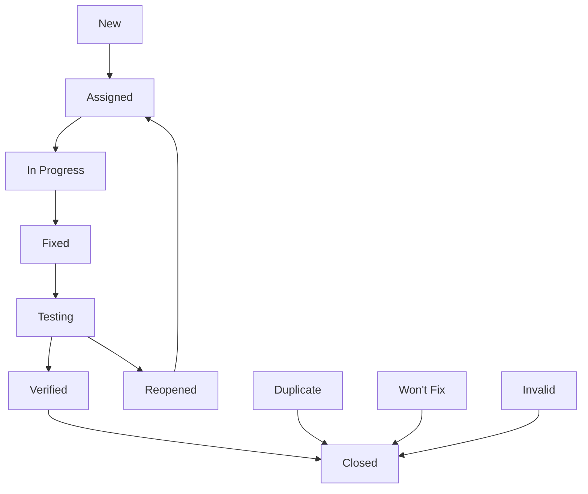

# **8. 버그 리포트 및 이슈 추적 (Bug Report & Issue Tracking)**

**참조 문서**: 0_architecture.md, 7_unit_Integration_Test.md
**작성일**: 2025-09-16
**버전**: 1.0

## **8.1 버그 분류 체계 (Bug Classification System)**

### **8.1.1 심각도 분류 (Severity Classification)**
```typescript
enum BugSeverity {
  CRITICAL = "critical",    // 시스템 전체 장애, 데이터 손실
  HIGH = "high",           // 핵심 기능 동작 불가
  MEDIUM = "medium",       // 일부 기능 이상, 우회 방법 존재
  LOW = "low",            // UI 문제, 성능 저하
  TRIVIAL = "trivial"     // 오타, 미세한 UI 불일치
}

enum BugPriority {
  P0 = "p0",              // 즉시 수정 (24시간 내)
  P1 = "p1",              // 긴급 수정 (3일 내)
  P2 = "p2",              // 중요 수정 (1주 내)
  P3 = "p3",              // 일반 수정 (2주 내)
  P4 = "p4"               // 저우선순위 (다음 버전)
}
```

### **8.1.2 컴포넌트별 분류 (Component Classification)**
```typescript
enum BugComponent {
  // 백엔드 시스템
  API_ENDPOINT = "api_endpoint",
  AGENT_ORCHESTRATION = "agent_orchestration",
  LLM_INTEGRATION = "llm_integration",
  DATABASE = "database",
  CACHING = "caching",

  // 프론트엔드 시스템
  UI_COMPONENT = "ui_component",
  NAVIGATION = "navigation",
  CHAT_INTERFACE = "chat_interface",
  VISUALIZATION = "visualization",

  // 인프라
  DEPLOYMENT = "deployment",
  MONITORING = "monitoring",
  PERFORMANCE = "performance",
  SECURITY = "security"
}
```

## **8.2 버그 리포트 템플릿 (Bug Report Templates)**

### **8.2.1 표준 버그 리포트**
```markdown
# Bug Report: [BUG-YYYY-NNNN] 제목

## 기본 정보
- **발견일**: YYYY-MM-DD
- **리포터**: [이름/역할]
- **심각도**: [CRITICAL/HIGH/MEDIUM/LOW/TRIVIAL]
- **우선순위**: [P0/P1/P2/P3/P4]
- **컴포넌트**: [해당 컴포넌트]
- **영향 범위**: [사용자 수/기능 범위]

## 환경 정보
- **플랫폼**: [iOS/Android/Web]
- **OS 버전**: [버전 정보]
- **앱 버전**: [버전 번호]
- **디바이스**: [디바이스 모델]
- **네트워크**: [WiFi/Cellular/상태]

## 버그 설명
### 현재 동작 (Actual Behavior)
[현재 어떻게 동작하는지 상세 설명]

### 예상 동작 (Expected Behavior)
[어떻게 동작해야 하는지 설명]

### 재현 단계 (Steps to Reproduce)
1. [첫 번째 단계]
2. [두 번째 단계]
3. [세 번째 단계]
...

## 기술적 세부사항
### 오류 메시지
```
[오류 메시지 또는 로그]
```

### 스택 트레이스
```
[스택 트레이스 정보]
```

### 스크린샷/영상
[관련 스크린샷 또는 영상 첨부]

## 추가 정보
- **재현율**: [Always/Sometimes/Rarely]
- **워크어라운드**: [임시 해결 방법]
- **관련 이슈**: [관련된 다른 버그/이슈 번호]
```

### **8.2.2 성능 관련 버그 리포트**
```markdown
# Performance Bug: [PERF-YYYY-NNNN] 제목

## 성능 지표
- **현재 응답시간**: [실제 측정값]
- **목표 응답시간**: [요구사항]
- **메모리 사용량**: [측정값]
- **CPU 사용율**: [측정값]
- **네트워크 사용량**: [측정값]

## 측정 환경
- **테스트 도구**: [사용한 도구]
- **측정 조건**: [부하 조건, 데이터 크기 등]
- **측정 횟수**: [측정 반복 횟수]

## 성능 분석
### 병목 지점
[병목이 발생하는 구체적인 지점]

### 프로파일링 결과
```
[프로파일링 도구 출력 결과]
```

## 최적화 제안
[성능 개선을 위한 구체적인 제안사항]
```

### **8.2.3 보안 관련 버그 리포트**
```markdown
# Security Issue: [SEC-YYYY-NNNN] 제목

⚠️ **기밀성 주의**: 이 이슈는 수정 전까지 제한된 인원만 접근

## 보안 분류
- **취약점 유형**: [OWASP Top 10 분류]
- **CVSS 점수**: [계산된 CVSS 점수]
- **영향도**: [데이터 노출/시스템 침해/권한 상승 등]

## 취약점 설명
### 공격 시나리오
[구체적인 공격 방법과 시나리오]

### 영향 범위
[취약점으로 인한 잠재적 피해]

## 개념 증명 (PoC)
```
[안전한 범위 내에서의 개념 증명 코드]
```

## 수정 방안
### 즉시 완화 조치
[긴급하게 적용할 수 있는 임시 조치]

### 근본적 해결책
[취약점을 완전히 해결하는 방법]
```

## **8.3 SixSortingHat 특화 버그 패턴 (Specialized Bug Patterns)**

### **8.3.1 LLM Agent 관련 버그**
```typescript
interface AgentBugReport {
  agentType: 'white' | 'red' | 'black' | 'yellow' | 'green' | 'blue';
  mbtiPersonality: string;
  issueType: 'response_quality' | 'personality_deviation' | 'infinite_loop' | 'context_loss';
  conversationId: string;
  messageSequence: number;
  prompt: string;
  response: string;
  expectedResponse: string;
}

// 예시: 빨간 모자 에이전트 감정 표현 부족 버그
const agentBugExample = {
  bugId: "BUG-2025-0001",
  title: "빨간 모자 에이전트가 감정적 응답을 생성하지 않음",
  component: BugComponent.AGENT_ORCHESTRATION,
  severity: BugSeverity.MEDIUM,
  priority: BugPriority.P2,
  description: "빨간 모자(감정/직감) 에이전트가 논리적 응답만 생성하고 감정적 측면을 무시함",
  agentType: "red",
  mbtiPersonality: "ENFP",
  reproductionSteps: [
    "질문 입력: '새로운 직장으로 이직해야 할까요?'",
    "빨간 모자 에이전트 응답 확인",
    "감정적 측면(불안, 기대감, 걱정) 언급 여부 확인"
  ],
  actualBehavior: "논리적 분석만 제공: '이직의 장단점은...'",
  expectedBehavior: "감정적 측면 포함: '새로운 도전에 대한 설렘과 동시에 불안감을 느끼는 것은...'"
};
```

### **8.3.2 토론 진행 관련 버그**
```typescript
interface DebateFlowBugReport {
  issueType: 'agent_interruption' | 'infinite_debate' | 'premature_conclusion' | 'agent_redundancy';
  phaseStuck: 'starting' | 'discussing' | 'concluding' | 'completed';
  participationBalance: Record<string, number>; // 각 모자별 발언 횟수
  conversationLength: number;
  timeElapsed: number; // 밀리초
  lastActiveAgent: string;
}

// 예시: 무한 토론 버그
const debateFlowBugExample = {
  bugId: "BUG-2025-0002",
  title: "에이전트들이 결론에 도달하지 못하고 무한 반복",
  component: BugComponent.AGENT_ORCHESTRATION,
  severity: BugSeverity.HIGH,
  priority: BugPriority.P1,
  description: "토론이 20분 이상 지속되며 동일한 논점을 반복함",
  phaseStuck: "discussing",
  participationBalance: {
    white: 12, red: 8, black: 15, yellow: 6, green: 10, blue: 3
  },
  conversationLength: 54, // 메시지 수
  timeElapsed: 1200000, // 20분
  reproductionQuery: "원격근무와 사무실 근무 중 어느 것이 더 좋을까요?",
  rootCause: "파란 모자(조정/관리) 에이전트가 결론 도출 신호를 제때 보내지 않음"
};
```

### **8.3.3 실시간 스트리밍 관련 버그**
```typescript
interface StreamingBugReport {
  issueType: 'connection_drop' | 'message_loss' | 'order_mismatch' | 'duplicate_message';
  sseConnectionId: string;
  messageId: string;
  expectedSequence: number;
  actualSequence: number;
  networkCondition: 'stable' | 'unstable' | 'cellular' | 'wifi';
  reconnectionAttempts: number;
}

// 예시: SSE 메시지 순서 오류
const streamingBugExample = {
  bugId: "BUG-2025-0003",
  title: "SSE 스트리밍에서 메시지 순서가 뒤바뀜",
  component: BugComponent.API_ENDPOINT,
  severity: BugSeverity.MEDIUM,
  priority: BugPriority.P2,
  issueType: "order_mismatch",
  description: "여러 에이전트가 동시에 응답할 때 메시지 순서가 뒤바뀌어 대화 흐름이 깨짐",
  reproductionSteps: [
    "복잡한 질문으로 토론 시작",
    "4개 이상의 에이전트가 동시에 활성화되는 상황 유도",
    "프론트엔드에서 메시지 순서 확인"
  ],
  technicalDetails: {
    expectedSequence: [1, 2, 3, 4, 5],
    actualSequence: [1, 3, 2, 5, 4],
    sseEndpoint: "/debate/{id}/stream",
    concurrentAgents: 4
  }
};
```

## **8.4 버그 추적 워크플로우 (Bug Tracking Workflow)**

### **8.4.1 버그 생명주기 (Bug Lifecycle)**


### **8.4.2 상태별 담당자 및 액션**
```typescript
interface BugWorkflow {
  status: BugStatus;
  assignee: string;
  requiredActions: string[];
  timeLimit: number; // 시간(시간 단위)
}

enum BugStatus {
  NEW = "new",
  ASSIGNED = "assigned",
  IN_PROGRESS = "in_progress",
  FIXED = "fixed",
  TESTING = "testing",
  VERIFIED = "verified",
  CLOSED = "closed",
  REOPENED = "reopened",
  DUPLICATE = "duplicate",
  WONT_FIX = "wont_fix",
  INVALID = "invalid"
}

const workflowRules: Record<BugStatus, BugWorkflow> = {
  [BugStatus.NEW]: {
    status: BugStatus.NEW,
    assignee: "triage_team",
    requiredActions: ["심각도 분류", "컴포넌트 식별", "담당자 할당"],
    timeLimit: 24
  },
  [BugStatus.ASSIGNED]: {
    status: BugStatus.ASSIGNED,
    assignee: "developer",
    requiredActions: ["재현 확인", "근본 원인 분석", "수정 계획 수립"],
    timeLimit: 72
  },
  [BugStatus.IN_PROGRESS]: {
    status: BugStatus.IN_PROGRESS,
    assignee: "developer",
    requiredActions: ["코드 수정", "단위 테스트 작성", "통합 테스트 확인"],
    timeLimit: 168 // 1주
  },
  [BugStatus.FIXED]: {
    status: BugStatus.FIXED,
    assignee: "qa_engineer",
    requiredActions: ["수정사항 배포", "테스트 케이스 실행", "회귀 테스트"],
    timeLimit: 48
  }
};
```

### **8.4.3 에스컬레이션 규칙 (Escalation Rules)**
```typescript
interface EscalationRule {
  condition: string;
  action: string;
  notifyRoles: string[];
  timeThreshold: number;
}

const escalationRules: EscalationRule[] = [
  {
    condition: "CRITICAL severity && 2시간 미할당",
    action: "development_lead에게 즉시 할당",
    notifyRoles: ["development_lead", "product_manager"],
    timeThreshold: 2
  },
  {
    condition: "P0 priority && 24시간 미해결",
    action: "CTO에게 에스컬레이션",
    notifyRoles: ["cto", "development_lead", "product_manager"],
    timeThreshold: 24
  },
  {
    condition: "보안 취약점 && 4시간 미할당",
    action: "보안팀 리드에게 즉시 할당",
    notifyRoles: ["security_lead", "cto"],
    timeThreshold: 4
  }
];
```

## **8.5 자동화된 버그 감지 시스템 (Automated Bug Detection)**

### **8.5.1 Application Performance Monitoring (APM)**
```python
# 성능 기반 자동 버그 감지
import logging
from dataclasses import dataclass
from datetime import datetime
from typing import Dict, List

@dataclass
class PerformanceThreshold:
    metric_name: str
    warning_threshold: float
    critical_threshold: float
    time_window: int  # 초

class AutoBugDetector:
    def __init__(self):
        self.thresholds = {
            "api_response_time": PerformanceThreshold("API Response Time", 2.0, 5.0, 300),
            "llm_response_time": PerformanceThreshold("LLM Response Time", 10.0, 30.0, 300),
            "memory_usage": PerformanceThreshold("Memory Usage", 80.0, 95.0, 60),
            "error_rate": PerformanceThreshold("Error Rate", 1.0, 5.0, 300),
            "concurrent_users": PerformanceThreshold("Concurrent Users", 100, 500, 60)
        }

    def check_performance_metrics(self, metrics: Dict[str, float]) -> List[str]:
        """성능 지표를 확인하고 임계값 위반 시 자동 버그 리포트 생성"""
        violations = []

        for metric_name, value in metrics.items():
            if metric_name in self.thresholds:
                threshold = self.thresholds[metric_name]

                if value >= threshold.critical_threshold:
                    bug_id = self.create_performance_bug_report(metric_name, value, "CRITICAL")
                    violations.append(f"CRITICAL: {metric_name} = {value}")
                elif value >= threshold.warning_threshold:
                    bug_id = self.create_performance_bug_report(metric_name, value, "HIGH")
                    violations.append(f"WARNING: {metric_name} = {value}")

        return violations

    def create_performance_bug_report(self, metric_name: str, value: float, severity: str) -> str:
        """자동으로 성능 관련 버그 리포트 생성"""
        bug_id = f"AUTO-{datetime.now().strftime('%Y%m%d%H%M%S')}"

        bug_report = {
            "bug_id": bug_id,
            "title": f"Performance degradation: {metric_name} exceeds threshold",
            "severity": severity,
            "component": "performance",
            "auto_generated": True,
            "metric_name": metric_name,
            "measured_value": value,
            "threshold": self.thresholds[metric_name].critical_threshold if severity == "CRITICAL" else self.thresholds[metric_name].warning_threshold,
            "timestamp": datetime.now().isoformat(),
            "description": f"Automatic detection: {metric_name} measured at {value}, exceeding {severity.lower()} threshold"
        }

        # 버그 트래킹 시스템에 자동 등록
        self.submit_to_bug_tracker(bug_report)
        return bug_id
```

### **8.5.2 Agent 응답 품질 모니터링**
```python
class AgentQualityMonitor:
    def __init__(self):
        self.quality_checks = [
            self.check_response_relevance,
            self.check_personality_consistency,
            self.check_response_length,
            self.check_toxic_content
        ]

    def monitor_agent_response(self, agent_type: str, question: str, response: str, mbti_type: str) -> Dict:
        """에이전트 응답 품질을 모니터링하고 이상 패턴 감지"""
        issues = []

        for check in self.quality_checks:
            result = check(agent_type, question, response, mbti_type)
            if not result["passed"]:
                issues.append(result)

        if issues:
            self.create_agent_quality_bug_report(agent_type, question, response, issues)

        return {
            "passed": len(issues) == 0,
            "issues": issues,
            "quality_score": self.calculate_quality_score(issues)
        }

    def check_response_relevance(self, agent_type: str, question: str, response: str, mbti_type: str) -> Dict:
        """응답의 관련성 검사"""
        # 간단한 키워드 기반 관련성 검사 (실제로는 더 정교한 NLP 모델 사용)
        question_keywords = set(question.lower().split())
        response_keywords = set(response.lower().split())

        relevance_score = len(question_keywords.intersection(response_keywords)) / len(question_keywords)

        return {
            "check_name": "response_relevance",
            "passed": relevance_score >= 0.3,
            "score": relevance_score,
            "message": f"Response relevance score: {relevance_score:.2f}"
        }

    def check_personality_consistency(self, agent_type: str, question: str, response: str, mbti_type: str) -> Dict:
        """성격 일관성 검사"""
        personality_keywords = {
            "white": ["사실", "정보", "데이터", "객관적"],
            "red": ["느낌", "감정", "직감", "마음"],
            "black": ["위험", "문제", "주의", "단점"],
            "yellow": ["긍정적", "가능성", "기회", "장점"],
            "green": ["창의적", "아이디어", "새로운", "혁신"],
            "blue": ["관리", "조정", "계획", "체계"]
        }

        expected_keywords = personality_keywords.get(agent_type, [])
        found_keywords = [kw for kw in expected_keywords if kw in response]

        consistency_score = len(found_keywords) / len(expected_keywords) if expected_keywords else 1.0

        return {
            "check_name": "personality_consistency",
            "passed": consistency_score >= 0.2,
            "score": consistency_score,
            "message": f"Personality consistency score: {consistency_score:.2f}",
            "found_keywords": found_keywords
        }
```

### **8.5.3 시스템 헬스 체크**
```python
class SystemHealthChecker:
    def __init__(self):
        self.health_checks = [
            self.check_database_connection,
            self.check_redis_connection,
            self.check_llm_api_availability,
            self.check_disk_space,
            self.check_memory_usage
        ]

    async def run_health_checks(self) -> Dict:
        """전체 시스템 헬스 체크 실행"""
        results = {}
        overall_health = True

        for check in self.health_checks:
            try:
                result = await check()
                results[result["component"]] = result
                if not result["healthy"]:
                    overall_health = False
                    if result["severity"] in ["CRITICAL", "HIGH"]:
                        await self.create_system_health_bug_report(result)
            except Exception as e:
                results[check.__name__] = {
                    "component": check.__name__,
                    "healthy": False,
                    "error": str(e),
                    "severity": "CRITICAL"
                }
                overall_health = False

        return {
            "overall_health": overall_health,
            "timestamp": datetime.now().isoformat(),
            "checks": results
        }

    async def check_database_connection(self) -> Dict:
        """데이터베이스 연결 상태 확인"""
        try:
            # 실제 DB 연결 테스트
            # result = await db.execute("SELECT 1")
            return {
                "component": "database",
                "healthy": True,
                "response_time": 0.05,
                "message": "Database connection successful"
            }
        except Exception as e:
            return {
                "component": "database",
                "healthy": False,
                "error": str(e),
                "severity": "CRITICAL",
                "message": "Database connection failed"
            }

    async def check_llm_api_availability(self) -> Dict:
        """LLM API 가용성 확인"""
        try:
            # 실제 LLM API 호출 테스트
            # response = await llm_client.test_call()
            return {
                "component": "llm_api",
                "healthy": True,
                "response_time": 1.2,
                "message": "LLM API available"
            }
        except Exception as e:
            return {
                "component": "llm_api",
                "healthy": False,
                "error": str(e),
                "severity": "HIGH",
                "message": "LLM API unavailable"
            }
```

## **8.6 버그 예방 체크리스트 (Bug Prevention Checklist)**

### **8.6.1 코드 리뷰 체크리스트**
```markdown
## 에이전트 관련 코드 리뷰
- [ ] 에이전트별 성격 특성이 프롬프트에 명확히 반영됨
- [ ] MBTI 성격 요소가 응답 생성에 일관되게 적용됨
- [ ] 에이전트 간 대화 순서 로직이 올바르게 구현됨
- [ ] 무한 루프 방지 로직이 포함됨
- [ ] 토론 종료 조건이 명확히 정의됨

## API 관련 코드 리뷰
- [ ] SSE 연결 관리가 올바르게 구현됨
- [ ] 메시지 순서 보장 메커니즘이 있음
- [ ] 에러 핸들링이 적절히 구현됨
- [ ] Rate limiting이 적용됨
- [ ] 인증/권한 검사가 포함됨

## 데이터베이스 관련 코드 리뷰
- [ ] 트랜잭션 관리가 올바르게 구현됨
- [ ] 인덱스가 적절히 설정됨
- [ ] 쿼리 성능이 최적화됨
- [ ] 데이터 무결성 제약이 적용됨
- [ ] 백업/복구 절차가 고려됨

## 프론트엔드 관련 코드 리뷰
- [ ] 컴포넌트 재사용성이 고려됨
- [ ] 상태 관리가 일관되게 구현됨
- [ ] 에러 경계(Error Boundary)가 설정됨
- [ ] 접근성(Accessibility) 요구사항이 충족됨
- [ ] 성능 최적화가 적용됨
```

### **8.6.2 배포 전 검증 체크리스트**
```markdown
## 기능 검증
- [ ] 모든 단위 테스트 통과
- [ ] 통합 테스트 통과
- [ ] E2E 테스트 통과
- [ ] 성능 테스트 결과 만족
- [ ] 보안 취약점 스캔 완료

## 운영 환경 준비
- [ ] 모니터링 대시보드 설정
- [ ] 로그 수집 설정
- [ ] 알림 규칙 구성
- [ ] 롤백 절차 준비
- [ ] 장애 대응 플레이북 준비

## 문서화
- [ ] API 문서 업데이트
- [ ] 배포 가이드 작성
- [ ] 운영 가이드 업데이트
- [ ] 트러블슈팅 가이드 작성
- [ ] 변경사항 릴리즈 노트 작성
```

## **8.7 메트릭스 및 대시보드 (Metrics & Dashboard)**

### **8.7.1 버그 메트릭스**
```typescript
interface BugMetrics {
  // 양적 지표
  totalBugs: number;
  openBugs: number;
  resolvedBugs: number;
  criticalBugs: number;

  // 시간 지표
  averageResolutionTime: number; // 시간 단위
  averageTimeToAssign: number;
  averageTimeToFix: number;

  // 품질 지표
  bugReopenRate: number; // 재오픈율
  bugEscapeRate: number; // 배포 후 발견율
  testCoverage: number; // 테스트 커버리지

  // 컴포넌트별 분포
  bugsByComponent: Record<string, number>;
  bugsBySeverity: Record<string, number>;
  bugsByPriority: Record<string, number>;
}

class BugMetricsCalculator {
  calculateMetrics(bugs: BugReport[], timeframe: number): BugMetrics {
    const now = Date.now();
    const timeframeBugs = bugs.filter(bug =>
      now - bug.createdAt.getTime() <= timeframe
    );

    return {
      totalBugs: timeframeBugs.length,
      openBugs: timeframeBugs.filter(bug =>
        !["closed", "verified"].includes(bug.status)
      ).length,
      resolvedBugs: timeframeBugs.filter(bug =>
        ["closed", "verified"].includes(bug.status)
      ).length,
      criticalBugs: timeframeBugs.filter(bug =>
        bug.severity === BugSeverity.CRITICAL
      ).length,

      averageResolutionTime: this.calculateAverageResolutionTime(timeframeBugs),
      averageTimeToAssign: this.calculateAverageTimeToAssign(timeframeBugs),
      averageTimeToFix: this.calculateAverageTimeToFix(timeframeBugs),

      bugReopenRate: this.calculateReopenRate(timeframeBugs),
      bugEscapeRate: this.calculateEscapeRate(timeframeBugs),
      testCoverage: this.calculateTestCoverage(),

      bugsByComponent: this.groupByComponent(timeframeBugs),
      bugsBySeverity: this.groupBySeverity(timeframeBugs),
      bugsByPriority: this.groupByPriority(timeframeBugs)
    };
  }
}
```

### **8.7.2 실시간 모니터링 대시보드**
```typescript
interface DashboardConfig {
  widgets: DashboardWidget[];
  refreshInterval: number;
  alertThresholds: Record<string, number>;
}

interface DashboardWidget {
  id: string;
  type: 'chart' | 'metric' | 'table' | 'alert';
  title: string;
  dataSource: string;
  config: any;
}

const bugTrackingDashboard: DashboardConfig = {
  refreshInterval: 30000, // 30초
  alertThresholds: {
    critical_bugs: 1,
    open_p0_bugs: 1,
    average_resolution_time: 24, // 시간
    bug_reopen_rate: 0.1 // 10%
  },
  widgets: [
    {
      id: "bug_overview",
      type: "metric",
      title: "버그 현황 요약",
      dataSource: "bug_metrics",
      config: {
        metrics: ["totalBugs", "openBugs", "criticalBugs"],
        timeframe: "24h"
      }
    },
    {
      id: "resolution_time_trend",
      type: "chart",
      title: "해결 시간 추이",
      dataSource: "bug_metrics",
      config: {
        chartType: "line",
        timeframe: "7d",
        metric: "averageResolutionTime"
      }
    },
    {
      id: "component_distribution",
      type: "chart",
      title: "컴포넌트별 버그 분포",
      dataSource: "bug_metrics",
      config: {
        chartType: "pie",
        metric: "bugsByComponent"
      }
    },
    {
      id: "critical_bugs_alert",
      type: "alert",
      title: "긴급 버그 알림",
      dataSource: "bug_alerts",
      config: {
        severity: ["CRITICAL", "HIGH"],
        status: ["new", "assigned"]
      }
    }
  ]
};
```

## **8.8 구현 우선순위 및 로드맵 (Implementation Priority & Roadmap)**

### **Phase 1: 기본 버그 추적 시스템 (1-2주)**
1. **버그 리포트 템플릿 구축**
   - 표준 버그 리포트 양식
   - 컴포넌트별 특화 템플릿
   - 자동화된 ID 생성

2. **기본 워크플로우 구현**
   - 버그 상태 관리
   - 담당자 할당 시스템
   - 기본 알림 기능

3. **GitHub Issues 통합**
   - 라벨 시스템 구축
   - 템플릿 적용
   - 자동화 스크립트

### **Phase 2: 자동화 및 모니터링 (3-4주)**
1. **자동 버그 감지 시스템**
   - APM 연동
   - 성능 임계값 모니터링
   - 자동 버그 리포트 생성

2. **에이전트 품질 모니터링**
   - 응답 품질 자동 검사
   - 성격 일관성 검증
   - 이상 패턴 감지

3. **시스템 헬스 체크**
   - 주요 컴포넌트 상태 모니터링
   - 자동 알림 시스템
   - 장애 예방 시스템

### **Phase 3: 고도화 및 분석 (5-6주)**
1. **고급 메트릭스 및 분석**
   - 버그 트렌드 분석
   - 예측 모델링
   - 품질 지표 대시보드

2. **CI/CD 통합**
   - 자동화된 테스트 게이트
   - 배포 전 품질 검증
   - 롤백 자동화

3. **머신러닝 기반 개선**
   - 버그 우선순위 자동 결정
   - 유사 버그 자동 감지
   - 수정 시간 예측

이 버그 리포트 및 이슈 추적 시스템은 SixSortingHat 프로젝트의 품질 보장과 안정적인 운영을 위한 핵심 인프라입니다. 0_architecture.md에서 정의된 복잡한 멀티 에이전트 시스템의 특성을 고려하여 에이전트별, 컴포넌트별 특화된 버그 추적 메커니즘을 제공하며, 7_unit_Integration_Test.md에서 정의된 테스트 전략과 긴밀히 통합되어 전체적인 품질 관리 체계를 완성합니다.